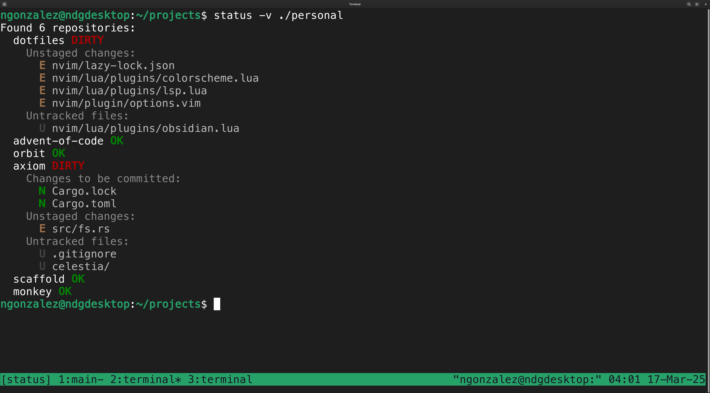

# Status

**Status** provides an overview of all Git repositories within a specified
directory, allowing you to easily identify which projects have local changes
that require pushing.

<div align="center">
    
</div>

## Installation

**Requires Python 3.10 or higher.**

This project is not on PyPI, but you can still install it using pip:

```bash
pip install git+https://github.com/nicdgonzalez/status.git
```

Once installed, run `status --verbose` in a directory with git repositories:

```bash
status --verbose [path]
```

Example output (typically has color):

```txt
Found 8 repositories:
  dotfiles DIRTY
    Unstaged changes:
      E nvim/lazy-lock.json
      E nvim/lua/plugins/colorscheme.lua
      E nvim/lua/plugins/lsp.lua
      E nvim/plugin/options.vim
    Untracked files:
      U nvim/lua/plugins/obsidian.lua
  advent-of-code OK
  orbit OK
  axiom DIRTY
    Changes to be committed:
      N Cargo.lock
      N Cargo.toml
    Unstaged changes:
      E src/fs.rs
    Untracked files:
      U .gitignore
      U celestia/
  scaffold OK
  monkey OK
  status DIRTY
    Unstaged changes:
      E README.md
      D status.py
    Untracked files:
      U .gitignore
      U pyproject.toml
      U status/
      U tox.ini
  colorize OK
```
